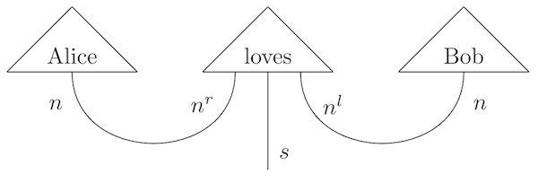

# Distributional Compositional Python

`discopy` computes natural language meaning in pictures.



## Recipe

1) Draw your picture.

```python
from discopy import Ty, Word, Cup, Wire

s, n = Ty('s'), Ty('n')
Alice, Bob = Word('Alice', n), Word('Bob', n)
loves = Word('loves', n.r @ s @ n.l)

sentence = Alice @ loves @ Bob >> Cup(n, n.r) @ Wire(s) @ Cup(n.l, n)
```

2) Define a model.

```python
from discopy import Model

ob = {s: 1, n: 2}
ar = {Alice: [1, 0], loves: [0, 1, 1, 0], Bob: [0, 1]}
F = Model(ob, ar)
```

3) Compute the meaning!

```python
assert F(sentence)
```

## Requirements

* If you just want to play with free categories, there are no requirements.
* If you want to compute matrix-valued functors, you will need [numpy](https://numpy.org/).
* If you want to evaluate quantum circuits for real, you will need [pytket](https://github.com/CQCL/pytket).
* If you want to differentiate your matrix-valued functors, you will need [jax](https://github.com/google/jax).

## Getting Started

Either a) install from pip:

```shell
pip install discopy
```

or b) install from sources:

```
git clone https://github.com/toumix/discopy.git
cd discopy
python setup.py install
```

## Documentation

For now all of it is in the code. You can use `help` if needed:

```python
>>> help(discopy.cat.Arrow)

Help on class Arrow in module discopy.cat:

class Arrow(builtins.list)
 |  Arrow(dom, cod, gens)
 |
 |  Defines an arrow with domain, codomain and a list of generators.
 |
 |  >>> x, y, z, w = Ob('x'), Ob('y'), Ob('z'), Ob('w')
 |  >>> f, g, h = Gen('f', x, y), Gen('g', y, z), Gen('h', z, w)
 |  >>> assert f >> g >> h == Arrow(x, w, [f, g, h])
```

You can also checkout the [notebooks](notebooks/) for a demo!

## References

* [pregroup grammars](https://ncatlab.org/nlab/show/pregroup+grammar) on the nLab
* Coecke (2019) [The Mathematics of Text Structure](https://arxiv.org/abs/1904.03478)
* Grefenstette and Sadrzadeh (2010) [Experimental Support for a Categorical Compositional Distributional Model of Meaning](https://arxiv.org/abs/1106.4058)
* Clark et al. (2008) [A Compositional Distributional Model of Meaning](http://citeseerx.ist.psu.edu/viewdoc/download?doi=10.1.1.363.8703&rep=rep1&type=pdf)
